# Chicago Crime Time Series Analysis (2001-2022)

Portfolio Project 3, Part 1. A time series analysis of Chicago crime data built to answer a set of business questions for a local newspaper, each backed by data and a visualization.

## Data

Source: Chicago Data Portal, Crimes 2001 to Present. Loaded from a zip of per-year CSVs and concatenated into one DataFrame indexed by datetime. Two forms of the data are kept: the raw per-event data (one row = one crime) and a daily resampled version (one row = one day) used for the seasonality work.

## Methods

- `pandas` for datetime indexing, resampling, groupby aggregation
- `statsmodels.tsa.seasonal_decompose` for trend/seasonal decomposition (period=7 and period=365)
- `holidays` package for US holiday mapping
- Linear regression slope (`np.polyfit`) to detect crime types moving against the overall trend
- Correlation of normalized monthly distributions to detect crime types with a different seasonal shape

---

## Business Question 1: Which police district had the most crime in 2022? Which had the least?

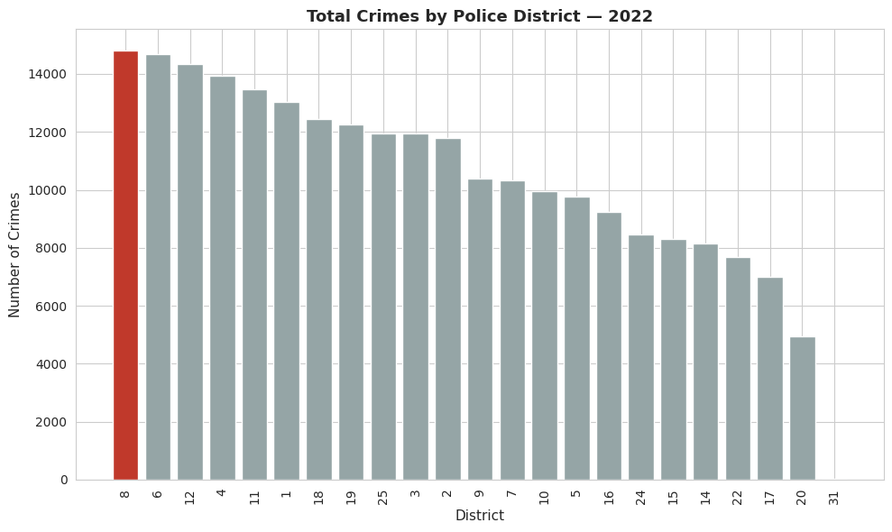

District 8 recorded the highest crime volume in 2022 at roughly 14,800 incidents, close to double the lowest districts. District 31 shows almost zero incidents, but that is not a real patrol district, it is used for administrative and records purposes in the Chicago Police data, so it was excluded from the comparison. Once excluded, District 20 is the genuine lowest at around 4,900 incidents. The gap between highest and lowest is close to 10,000 incidents a year, which tells a resourcing story: patrol allocation, staffing, and community programs are not likely spread evenly if the underlying crime load isn't either.

## Business Question 2: Is total crime in Chicago increasing or decreasing across the years?

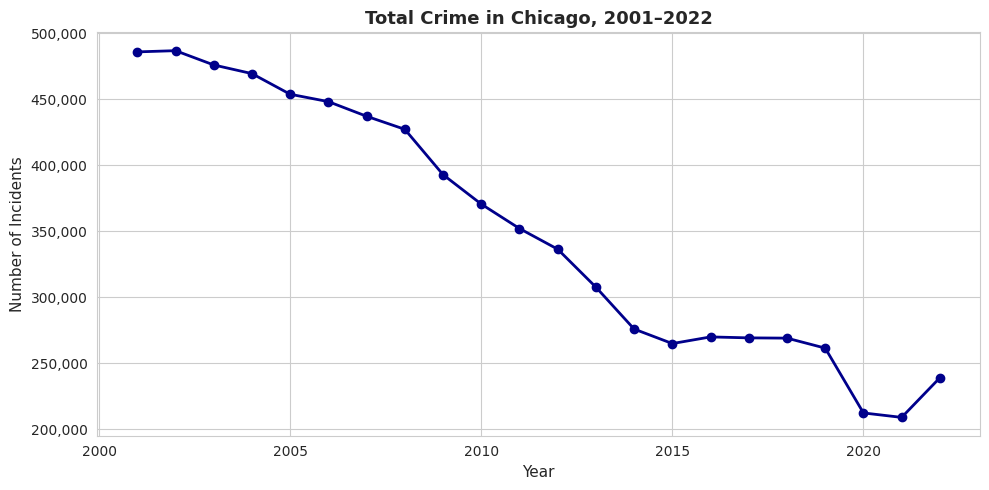

Total crime fell almost every single year from 2001 (about 487,000 incidents) to 2021 (about 211,000), a drop of more than 55% over two decades. That is a structural decline, not noise, confirmed later by the trend component of the seasonal decomposition. 2022 breaks that pattern for the first time, rising back to about 240,000. A single year of increase after 20 years of decline is not enough to call a reversal in direction, but it is a data point worth flagging to a reporter as the story: the long decline just stopped.

## Business Question 3: Are crimes more common during AM or PM rush hour?

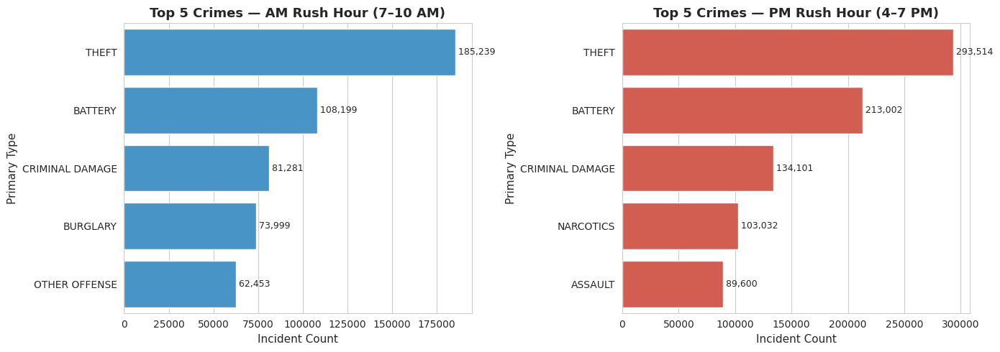

AM rush hour is defined as 7 to 10 AM, PM rush hour as 4 to 7 PM. The top 5 crime categories are identical in both windows (Theft, Battery, Criminal Damage, then Burglary/Narcotics and Other Offense/Assault), but every category is higher in the PM window. Theft alone goes from about 185,000 incidents in the AM window to about 293,000 in the PM window, a 58% increase. This is consistent with more people, more vehicles, and more retail activity on the street in the evening compared to the morning commute.

## Business Question 4: Is Motor Vehicle Theft more common during AM or PM rush hour?

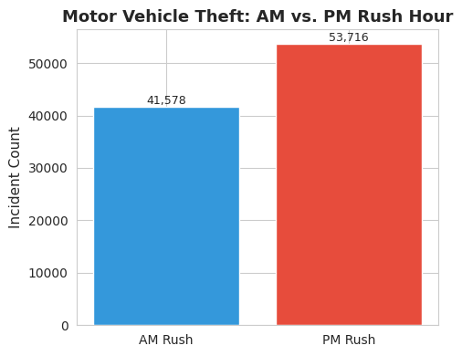

PM rush hour again: 53,716 incidents versus 41,578 in the AM window, about a 29% increase. This lines up with the overall rush hour finding and adds a specific, actionable data point: vehicle owners and law enforcement should treat the evening commute window as higher risk for theft, not the morning.

## Business Question 5: What months have the most and least crime?

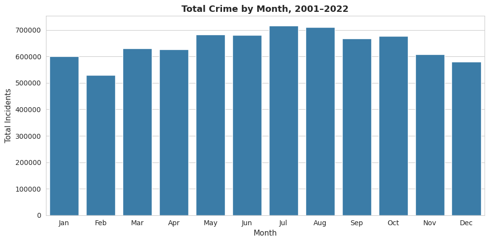

July is the peak month at roughly 715,000 incidents across the full 2001-2022 period, February is the lowest at roughly 530,000. The pattern is a clean seasonal curve: crime rises through spring, peaks in summer (May through October all sit well above the winter months), then falls back down through winter. This tracks with more people outdoors and more opportunity for street-level crime in warm weather.

## Business Question 6: Are there individual crime types that don't follow the seasonal (monthly) pattern?

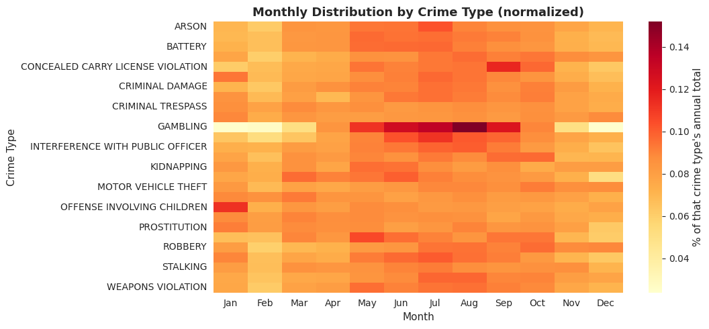

Most crime types follow the general summer-peak shape, but two stand out as different. Gambling is heavily concentrated from May through September, with a sharp spike in August, a much tighter and later peak than the general pattern. Offense Involving Children spikes in January instead of summer, the opposite of what the rest of the data shows. These were identified by correlating each crime type's normalized monthly distribution against the overall monthly distribution: both had the lowest correlation of all crime types with sufficient volume, meaning their monthly shape genuinely diverges rather than just having noisy small-sample variation.

## Business Question 7: What are the top 3 holidays for crime?

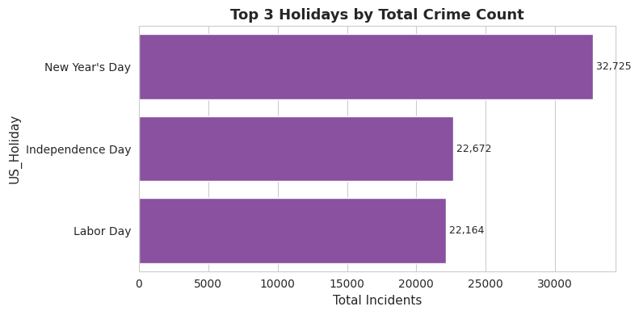

New Year's Day leads clearly at 32,725 incidents, well ahead of Independence Day (22,672) and Labor Day (22,164), which are close to each other. New Year's Day sees roughly 48% more crime than the second-place holiday, this isn't a marginal difference, it's the standout day of the year.

## Business Question 8: For the top 3 holidays, what are the top 5 crimes on each?

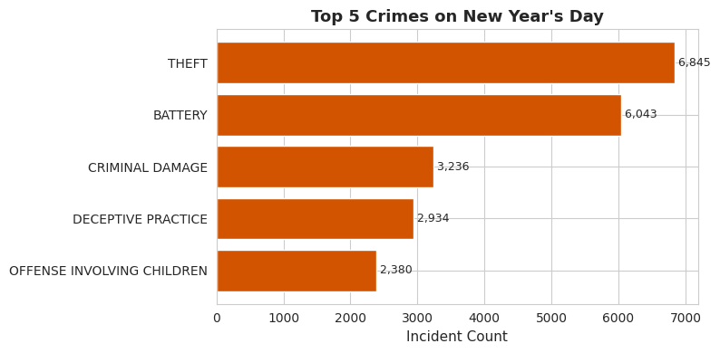
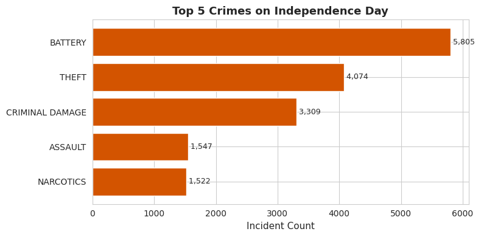
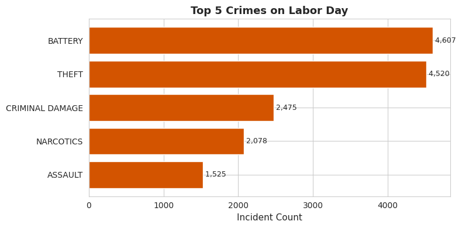

New Year's Day: Theft, Battery, Criminal Damage, Deceptive Practice, Offense Involving Children. Deceptive Practice (fraud-type offenses) only appears in the top 5 on this holiday, likely tied to post-holiday shopping and returns activity.

Independence Day: Battery, Theft, Criminal Damage, Assault, Narcotics. This is the only one of the three holidays where Battery outranks Theft, consistent with fireworks, large gatherings, and alcohol-related incidents driving more violent, less property-based crime.

Labor Day: Battery, Theft, Criminal Damage, Narcotics, Assault. Battery and Theft are nearly tied (4,607 vs 4,520), and the overall composition closely mirrors Independence Day.

## Business Question 9: What cycles (seasonality) exist in the data? How long is each cycle and what is its magnitude?

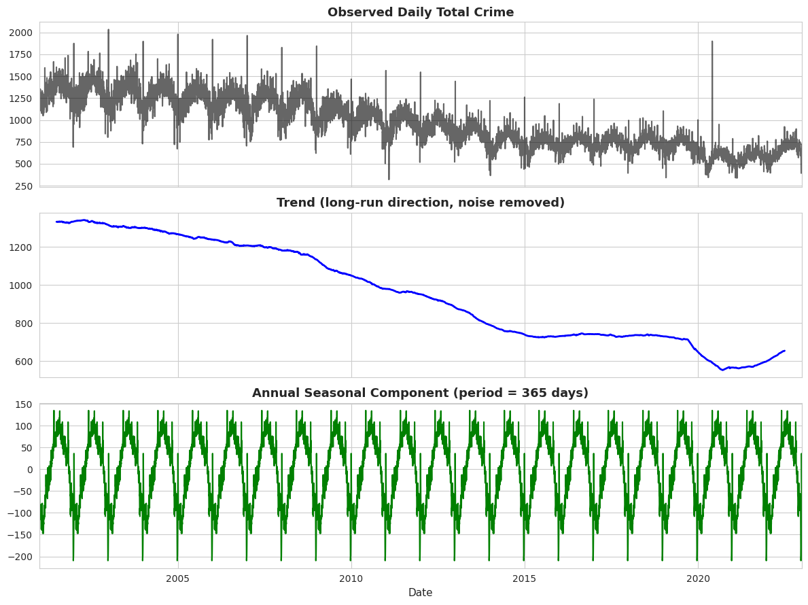
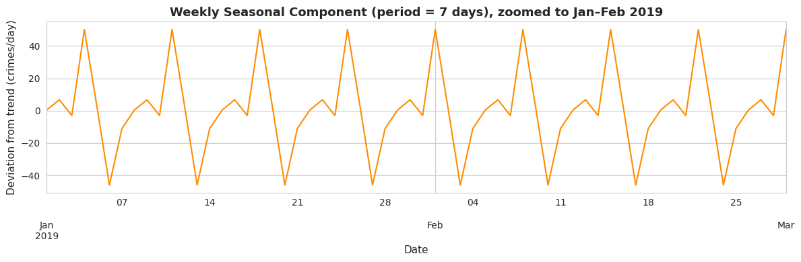

Two distinct, statistically clean cycles were found by decomposing the daily crime series with `seasonal_decompose`.

**Annual cycle (period = 365 days):** peaks in summer, troughs in winter, with a magnitude of about 280 crimes/day (from roughly -140 to +140 around the trend). This cycle is remarkably stable, repeating with almost identical shape every single year in the 22-year window, and it sits on top of the declining trend line rather than being affected by it.

**Weekly cycle (period = 7 days):** peaks near the weekend at about +50 crimes/day above trend, drops to a trough of about -48 crimes/day midweek, a magnitude of roughly 98 crimes/day. This cycle also repeats with no drift across the full period. Running the same decomposition on Theft alone shows the identical weekly shape but a smaller swing (+16 to -26), meaning Theft follows the city-wide weekly rhythm but contributes less of the swing than crime overall.

Together, these two cycles show that Chicago crime is highly predictable in shape (same weekly and annual rhythm every cycle) even while the overall level has changed dramatically over two decades.

---

## Key Findings

- Crime fell over 55% from 2001 to 2021, then rose again in 2022.
- District 8 has the most crime in 2022, District 20 the least (excluding the administrative District 31).
- PM rush hour beats AM rush hour across every major category, including motor vehicle theft.
- July is the peak month, February the lowest. Gambling and Offense Involving Children break that pattern.
- New Year's Day is the highest-crime holiday by a clear margin.
- Crime repeats on two reliable, non-drifting cycles: 7 days and 365 days.

## Repo Structure

```
├── Chicago_Crime_Time_Series_Part1.ipynb
├── README.md
├── district_crime_2022.png
├── total_crime_trend_2001_2022.png
├── rush_hour_top5_comparison.png
├── motor_vehicle_theft_am_vs_pm.png
├── total_crime_by_month.png
├── monthly_distribution_heatmap.png
├── top3_holidays.png
├── top5_crimes_new_years.png
├── top5_crimes_independence_day.png
├── top5_crimes_labor_day.png
├── seasonal_decomposition_annual.png
└── seasonal_decomposition_weekly.png
```

## Limitations

- District, Ward, and Location fields have missing values, excluded only from the analyses that need them.
- Primary Type reflects how a crime was classified at report time, not confirmed outcome.
- Holiday matching uses calendar date only, not observed or shifted dates some agencies use for staffing.
